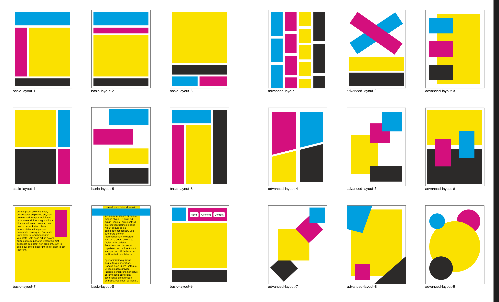

# Layout in CSS

Een oefening in Layout Modes met CSS. Fork deze deeltaak, en ga aan de slag.

## Context

Deze leertaak hoort bij Sprint 2 The Client. Dit is een deeltaak die je individueel uitvoert en waarmee je bewijslast verzamelt.

_In het college _S02W02 Flow en Layout_ wordt verteld over Layout Modes in CSS. Deze deeltaak behandelt verschillende typen layouts en is bedoeld als robuuste oefening in het maken van layouts._

CSS heeft een aantal verschillende manieren waarop je HTML kunt voorzien van een layout. Elke manier heeft eigen voor- en nadelen, en het is goed om de verschillende methodes je eigen te maken. Layout modes zijn ook te combineren, waardoor je verschillende ontwerpproblemen kunt oplossen.

Nadat je gestructureerde HTML hebt gemaakt, kun je elk onderdeel van een pagina of component van layout voorzien. En gecombineerd met media queries kun je responsive layouts maken.

## Doel van deze opdracht

In onderstaande afbeelding zie je 18 verschillende layouts die je met CSS kunt maken. Negen daarvan zijn basic layouts welke je met Normal Flow, Grid Layout, Flexible Box Layout, Float Layout en Positioned Layout kunt maken. Naast deze basic layouts zijn er ook negen advanced layouts waarvoor je iets meer trucage uit je mouw moet schudden.

Waarom zou je dit doen? Omdat je oefent met veel verschillende layouts en verschillende Layout Modes. Na het succesvol implementeren van alle bovenstaande layouts heb je altijd een soort *spiekbriefje* om naar terug te kijken als je een layout maakt.

> *“Wax on right hand. Wax off left hand. Wax on, wax off. Breathe in through nose, out through mouth. Wax on, wax off. Don't forget to breathe. Very important.”* - Mr. Miyagi

## Werkwijze

Omdat deze deeltaak bestaat uit 18 kleine opdrachten doorloop je telkens de development lifecycle. Misschien had je al vaker het idee dat je dit telkens in het klein doet bij elke grotere opdracht, als je een probleem oplost.

Voor elke layout die je uit gaat werken, gelden onderstaande stappen. Werk in eerste instantie alle basic layouts uit, en ga door met de advanced layouts als je nog zin hebt in een uitdaging.

### Analyseren

Kies een layout die je gaat maken. Onderzoek kort welke Layout Mode hiervoor geschikt is. Hieronder staat een lijst met hints die je zou kunnen gebruiken.

#### Aanpak

1. Maak een nieuw issue aan op jouw geforkte repo, met daarin de naam en het nummer van de layout die je gaat maken.
2. Schrijf alvast wat hints over de Layout Mode die je gaat gebruiken, en links naar bronnen die je nodig gaat hebben in de beschrijving van je issue.
3. Ga door naar Ontwerpen.

#### Hints

- Basic layout 1: Grid Layout
- Basic layout 2: Flow Layout, Grid Layout of Flexible Box Layout
- Basic layout 3: Grid Layout
- Basic layout 4: Grid Layout
- Basic layout 5: Flow Layout, Grid Layout of Flexible Box Layout
- Basic layout 6: Grid Layout
- Basic layout 7: Flow Layout én Float Layout gecombineerd
- Basic layout 8: Flow Layout én Positioned Layout gecombineerd
- Basic layout 9: Grid Layout én Flexible Box Layout gecombineerd

Voor de advanced layouts kun je deze hints gebruiken:

- Advanced layout 1: Multi-column Layout of Masonry Layout (experimenteel)
- Advanced layout 2: Grid Layout + Transforms
- Advanced layout 3: Grid Layout
- Advanced layout 4: Grid Layout + clip-path
- Advanced layout 5: Grid Layout
- Advanced layout 6: Grid Layout of Positioned Layout
- Advanced layout 7: Grid Layout of Positioned Layout + Transforms
- Advanced layout 8: Positioned Layout
- Advanced layout 9: Grid Layout + border-radius of clip-path

#### Bronnen

- [Layout mode @ MDN](https://developer.mozilla.org/en-US/docs/Web/CSS/Layout_mode)
- [Layout @ web.dev](https://web.dev/learn/css/layout/)
- [CSS layout @ MDN](https://developer.mozilla.org/en-US/docs/Learn/CSS/CSS_layout)
- [A Complete Guide to Grid @ CSS Tricks](https://css-tricks.com/snippets/css/complete-guide-grid/)
- [A Complete Guide to Flexbox @ CSS Tricks](https://css-tricks.com/snippets/css/a-guide-to-flexbox/)
- [Flow Layout @ MDN](https://developer.mozilla.org/en-US/docs/Web/CSS/CSS_flow_layout)
- [Floats @ MDN](https://developer.mozilla.org/en-US/docs/Learn/CSS/CSS_layout/Floats)
- [CSS challenge 1: Grid, door Sanne](https://github.com/fdnd-task/css-challenges/blob/main/docs/challenge_grid.md)
- [CSS challenge 4: Flexbox, door Sanne](https://github.com/fdnd-task/css-challenges/blob/main/docs/challenge_flexbox.md)

### Ontwerpen

Maak een snelle breakdown schets van de CSS, welke je gebruikt om de layout te implementeren.

#### Aanpak

1. Onderzoek met behulp van bovenstaande bronnen en hints hoe je de layout zou kunnen maken in CSS, en welke eigenschappen van die Layout Mode je hiervoor nodig gaat hebben.
2. Teken de layout na op papier en zet er wat annotaties bij over hoe je de vlakverdeling met CSS kunt bereiken. 
3. Voor Grid Layout: teken de grid lines met een afwijkende kleur over de layout heen.
4. Voeg je schets toe als reactie op het issue dat je net hebt aangemaakt.
5. Ga door naar Bouwen.

### Bouwen

Implementeer de layout in het betreffende HTML bestand dat al voor je klaar staat.

#### Aanpak

1. Gebruik de hints, de bronnen hierboven, je eigen onderzoek en je breakdown schets om de CSS voor de layout uit te schrijven in het HTML bestand dat al voor je klaar staat in de `basic` en `advanced` mappen in deze repo. Als het goed is, hoef je aan de HTML zelf niets te veranderen, en kun je in het `` element aan de slag.
2. Gebruik voor Grid Layout en Flexible Box Layout de inspector tools in je devtools. Zie de bronnen hieronder voor meer informatie.
3. Vraag regelmatig om feedback of hulp, en overleg met medestudenten.
4. Check doorlopend jouw aanpassingen in de browser (baby-steps approach), totdat je tevreden bent. De layouts hoeven uiteraard niet pixel-perfect nagemaak te worden.
5. Ga door naar Integreren.

#### Bronnen

- [CSS Grid Inspector: Examine grid layouts @ Firefox](https://firefox-source-docs.mozilla.org/devtools-user/page_inspector/how_to/examine_grid_layouts/index.html)
- [CSS Flexbox Inspector: Examine Flexbox layouts @ Firefox](https://firefox-source-docs.mozilla.org/devtools-user/page_inspector/how_to/examine_flexbox_layouts/index.html)
- [Inspect CSS grid layouts @ Chrome](https://developer.chrome.com/docs/devtools/css/grid)
- [Inspect and debug CSS flexbox layouts @ Chrome](https://developer.chrome.com/docs/devtools/css/flexbox/)

### Integreren

Voer een commit uit op jouw GitHub repository met de layout die je zojuist geïmplementeerd hebt. Op deze manier kan je altijd terug naar een versie waarvan je weet dat alles in orde was.

#### Aanpak

1. Voer in GitHub een commit message in, gebruik de naam van de layout die je zojuist geïmplementeerd hebt, en noem het nummer van het issue waar je aan werkt.
2. Push je code naar GitHub.
3. Ga door naar Testen.

### Testen

Test in een browser of de versie die je net online gezet hebt ook via GitHub Pages werkt.

#### Aanpak

1. Open jouw repository via de directe link van GitHub Pages.
2. Check of alles werkt.
3. Vergelijk jouw implementatie even met een klasgenoot.
4. Als je iets nieuws hebt gebruikt voor deze layout, beschrijf dit dan in je Learning Journal.

Ga hierna opnieuw door al deze stappen heen met een volgende layout.

## Definition of Done

Deze opdracht is done als:

- [ ] De 9 basis layouts zijn voltooid aan de hand van bovenstaande stappen.
- [ ] Alle breakdown schetsen voor de layouts in je issues zijn opgenomen.
- [ ] Al je werk is te bekijken via GitHub pages.